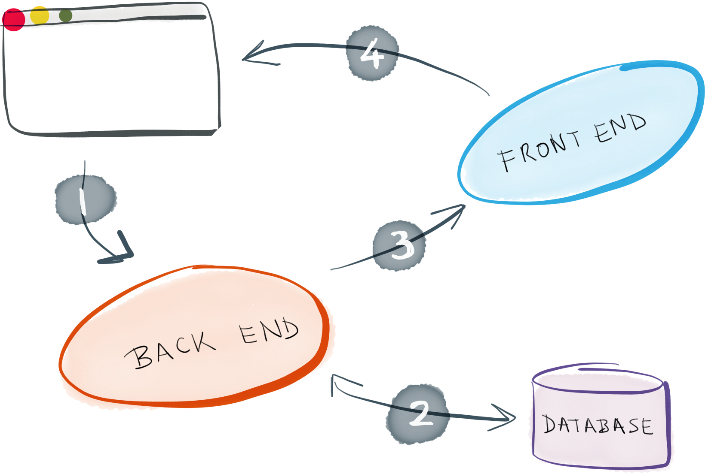

## To-do Web Manager
> ---

### 1 Описание приложения:

Web-приложение "Список дел" предназначено для уменьшение нагрузки на память человека путём оставления заметок. 
Приложение создано для пользователей любой операционной системы так как работает в работает в браузере. Приложение позволит создавать, редактировать существующие и удалять неактуальные записи. 
Приложение будет написано на новейших технологиях веб разработки, используя популярные подходы разработки ПО.

&nbsp;

### 2 Составляющие проекта:

2.1 База данных. Хранение данных будет реализовано в SQL таблицах, где будет информация 
о пользователях и их заметках.

2.2 Backend. Серверная часть будет реализовывать главную логику приложения, работать с базой данных через SQL запросы. Язык написания: NodeJS

2.3 Frontend. Клиентская часть будет реализовывать функционал backend приложения посредством вызова API методов.
Язык написания: JavaScript фреймворк - React. Приложение может быть запущено в любом браузере на любой системе.

&nbsp;

### 3 Основной функционал проекта:

Приложение список дел включает в себя несколько основный функций:

- Аутентификация пользователя.
    - Вход в систему
    - Регистрация 
- Работа со своими заметками заметками
    - Добавление новой заметки
    - Удаление заметки
    - Редактирование заметки

Информация о пользователях и их задачах хранится в отдельных таблицах базы данных.

&nbsp;

### 4 Схема взаимодействия компонентов проекта:



&nbsp;

### 5 Графический материал:

5.1 [Диаграммы](https://github.com/kharbacheuski/to-do-web-manager/tree/main/documentation/diagrams/README.md)

5.2 [Скриншоты](https://github.com/kharbacheuski/to-do-web-manager/tree/main/documentation/screenshots/README.md)

&nbsp;

### 6 Исходный код проекта:

6.1 [Frontend](https://github.com/kharbacheuski/to-do-web-manager/tree/main/project-code/client)

6.2 [Backend](https://github.com/kharbacheuski/to-do-web-manager/tree/main/project-code/server)

6.3 [DB](https://github.com/kharbacheuski/to-do-web-manager/tree/main/project-code/data-base)

&nbsp;

### Запуск проекта:

Для того чтобы полностью развернуть проект понадобится привести в рабочее состояние три слоя проекта в следующей последовательности:

- База данных
- Серверная часть
- Клиентская часть

&nbsp;

0) Для начала нужно установить зависимости: Node (например v14.18.0), MySQL Server, MySQL Workbench - UI для взаимодействия с базами данных (опционально)

1) Для запуска базы данных, создайте SQL схему (структурный дамп лежит в директории ```project-code/data-base```) и запустите MySQL Server

2) Для запуска серверной части, нужно перейти в директорию ```project-code/server```
    - В файле db/connect.js должны быть валидные данные для подключения к базе данных
    - Из консоли выполнить команду ```npm run server -- <db_password>```, где db_password - пароль к базе данных

3) Для запуска клиента, нужно перейти в директорию ```project-code/client``` из консоли выполнить команду
    - ```npm run start``` для запуска в режиме разработки
    - ```npm run build``` для запуска в режиме деплоя
